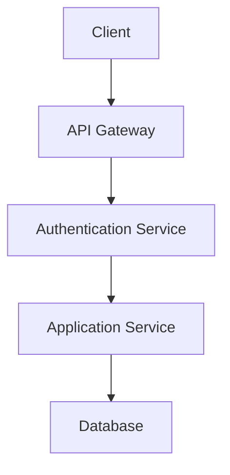

# [Component Name] Security Documentation

*Version: 1.0.0*  
*Last Updated: [Date]*  
*Document Owner: [Name]*  
*Access Level: Restricted*  
*Classification: Confidential*

## Overview

[Brief description of the component and its security requirements]

## Security Architecture

### Components

1. [Component 1]
   - Description
   - Security responsibilities
   - Dependencies

2. [Component 2]
   - Description
   - Security responsibilities
   - Dependencies

### Data Flow

## Authentication & Authorization

### Authentication Methods

1. **Primary Authentication**
   - Method: [Description]
   - Implementation: [Details]
   - Security measures: [List]

2. **Secondary Authentication**
   - Method: [Description]
   - Implementation: [Details]
   - Security measures: [List]

### Authorization Levels

| Level | Description | Access Rights |
|-------|-------------|---------------|
| Admin | Full system access | All operations |
| User | Standard user access | Limited operations |
| Guest | Restricted access | Read-only operations |

## Encryption

### Data at Rest

- Algorithm: [Algorithm name]
- Key length: [Length]
- Key rotation: [Frequency]
- Storage: [Location]

### Data in Transit

- Protocol: [Protocol name]
- Cipher suites: [List]
- Certificate management: [Details]

## Security Controls

### Access Control

1. **Physical Access**
   - Data center security
   - Server room access
   - Device management

2. **Logical Access**
   - User authentication
   - Role-based access control
   - Session management

### Monitoring & Logging

1. **Security Events**
   - Event types
   - Log format
   - Retention period

2. **Alerting**
   - Thresholds
   - Notification channels
   - Response procedures

## Vulnerability Management

### Scanning Schedule

| Component | Frequency | Tools | Owner |
|-----------|-----------|-------|-------|
| Web Application | Weekly | [Tool] | [Name] |
| API | Weekly | [Tool] | [Name] |
| Infrastructure | Monthly | [Tool] | [Name] |

### Patch Management

1. **Critical Patches**
   - Response time: [Timeframe]
   - Testing requirements: [Details]
   - Deployment process: [Steps]

2. **Regular Updates**
   - Schedule: [Frequency]
   - Testing requirements: [Details]
   - Deployment process: [Steps]

## Incident Response

### Incident Classification

| Level | Description | Response Time |
|-------|-------------|---------------|
| Critical | System compromise | Immediate |
| High | Data breach | 1 hour |
| Medium | Vulnerability | 24 hours |
| Low | Minor issue | 7 days |

### Response Procedures

1. **Detection**
   - Monitoring systems
   - Alert triggers
   - Initial assessment

2. **Containment**
   - Isolation procedures
   - Backup procedures
   - Communication plan

3. **Eradication**
   - Root cause analysis
   - System restoration
   - Verification steps

4. **Recovery**
   - System validation
   - Monitoring
   - Documentation

## Compliance

### Standards & Regulations

1. **GDPR**
   - Requirements
   - Implementation
   - Documentation

2. **ISO 27001**
   - Requirements
   - Implementation
   - Documentation

### Auditing

1. **Internal Audits**
   - Frequency
   - Scope
   - Process

2. **External Audits**
   - Frequency
   - Scope
   - Process

## Security Testing

### Penetration Testing

1. **Scope**
   - Systems included
   - Testing methods
   - Limitations

2. **Schedule**
   - Frequency
   - Duration
   - Reporting

### Code Review

1. **Process**
   - Review checklist
   - Tools
   - Approval requirements

2. **Automated Scanning**
   - Tools
   - Frequency
   - Action thresholds

## Related Documents

- [Related Document 1](link)
- [Related Document 2](link)

## Change Log

| Version | Date | Author | Description |
|---------|------|--------|-------------|
| 1.0.0 | [Date] | [Name] | Initial version |

## Review History

| Date | Reviewer | Comments | Status |
|------|----------|----------|--------|
| [Date] | [Name] | [Comments] | Approved/Rejected |

## Contact

For security-related questions or incidents:
- Security Lead: [Name]
- Email: [email@example.com]
- Emergency Contact: [phone] 